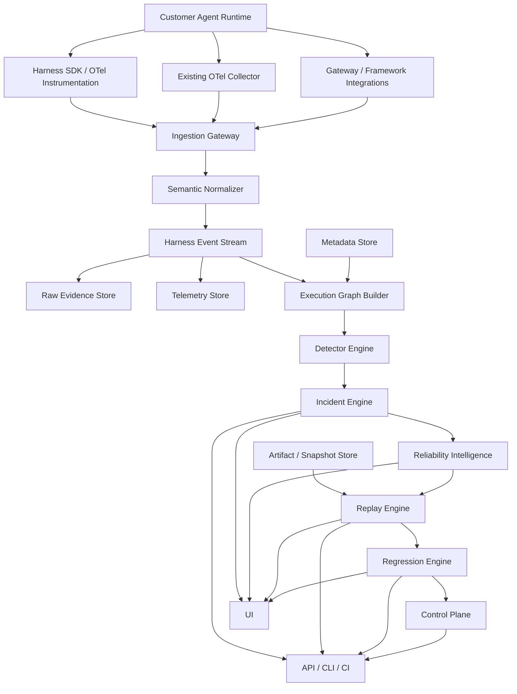
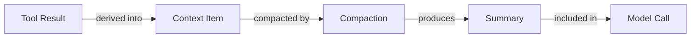
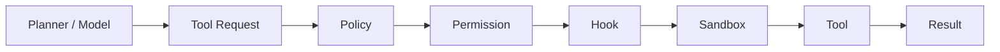
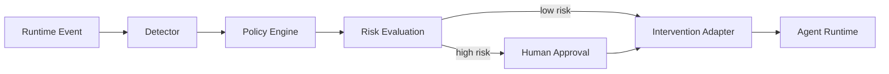
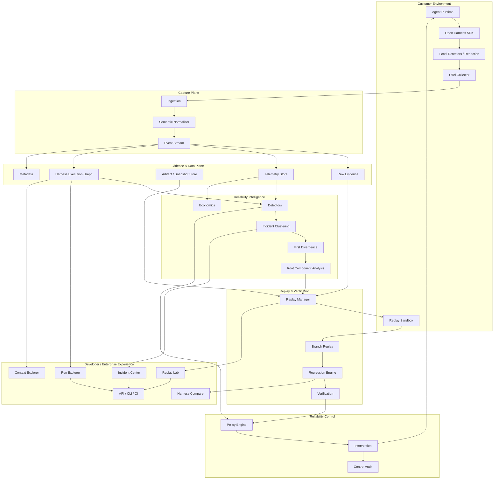

# Harness Reliability Control Plane

## Technical Architecture Specification

**Document ID:** HRCP-01\
**Version:** 0.1\
**Status:** Architecture Baseline\
**Date:** 30 September 2026\
**Depends On:** HRCP-00

---

# 1. Purpose

This document defines the target technical architecture of the Harness Reliability Control Plane.

It describes:

- system boundaries;
- telemetry collection;
- semantic normalization;
- execution identity;
- event model;
- execution graph;
- storage;
- detection;
- incident generation;
- trajectory analysis;
- replay;
- regression;
- verification;
- runtime control;
- APIs;
- enterprise deployment;
- security boundaries;
- extensibility.

It is intentionally architecture-level.

Exact wire schemas belong in HRCP-03.

---

# 2. Architecture Principles

The architecture must be:

```text
framework-independent

model-independent

provider-independent

OTel-native

append/evidence-oriented

version-aware

replay-aware

privacy-aware

multi-agent-aware

policy-aware

artifact-aware

API-first

horizontally scalable
```

---

# 3. System Context



---

# 4. Separation of Planes

The system should be logically separated into:

```text
DATA PLANE
telemetry capture and ingestion

INTELLIGENCE PLANE
analysis and incident generation

REPLAY PLANE
reconstruction and simulation

CONTROL PLANE
policy and intervention

MANAGEMENT PLANE
configuration, users, projects, retention
```

This separation improves security and reliability.

---

# 5. Telemetry Capture Layer

## Responsibilities

Capture events without forcing customers to redesign their runtime.

Sources may include:

```text
SDK

OTel

OpenInference

agent framework callbacks

model gateway

MCP

tool runtime

sandbox

container runtime

CI/CD

git

approval service

policy engine
```

---

# 6. SDK Strategy

The SDK should be thin.

It should primarily provide:

```text
instrumentation

context propagation

event helpers

semantic normalization

local buffering

redaction

sampling

export
```

It should not contain substantial commercial intelligence.

That keeps the instrumentation layer suitable for open source.

---

# 7. Automatic Instrumentation

Where possible, instrumentation should capture existing behavior automatically.

Examples:

```text
model requests

tool calls

MCP calls

framework agent runs

retrieval calls

subagent invocation
```

But harness-specific behavior may require explicit instrumentation.

Examples:

```text
verification gate

custom state transition

context compaction

human approval

business-specific artifact mutation
```

---

# 8. Event Envelope

Every normalized event should eventually contain an envelope resembling:

```json
{
  "event_id": "...",
  "event_type": "...",

  "timestamp": "...",

  "organization_id": "...",
  "project_id": "...",

  "run_id": "...",
  "agent_id": "...",
  "agent_instance_id": "...",

  "parent_event_id": "...",
  "correlation_ids": [],

  "harness_version": "...",

  "component": "...",
  "component_version": "...",

  "input_ref": "...",
  "output_ref": "...",

  "status": "...",

  "attributes": {},

  "evidence_refs": [],

  "schema_version": "..."
}
```

This is conceptual and not the final schema.

---

# 9. Identity Hierarchy

The platform should distinguish:

```text
Organization

Workspace / Project

Application

Agent Definition

Agent Version

Agent Instance

Run

Session

Iteration

Event
```

A long-running session may contain multiple runs.

A run may contain multiple agents.

An agent may create multiple subagents.

---

# 10. Execution Identity

The following IDs should not be conflated:

```text
trace_id

run_id

session_id

agent_id

agent_instance_id

subagent_id

task_id

workflow_id

artifact_id

incident_id

replay_id

regression_case_id
```

A single OTel trace ID may not always map cleanly to the product's semantic execution boundary.

---

# 11. Context Propagation

Cross-process and cross-agent causality requires propagation.

At minimum propagate:

```text
run identity

trace context

agent identity

delegation identity

task identity

harness version

policy version
```

Sensitive identity propagation should be minimized.

---

# 12. Harness Event Model

Top-level domains:

```text
RUN

LOOP

MODEL

PLAN

CONTEXT

MEMORY

RETRIEVAL

TOOL

MCP

HOOK

PERMISSION

POLICY

SANDBOX

STATE

AGENT

DELEGATION

HUMAN

VERIFICATION

ARTIFACT

BUDGET

RECOVERY

STOP

ENVIRONMENT
```

---

# 13. Run Events

Examples:

```text
run.started

run.resumed

run.paused

run.completed

run.failed

run.aborted
```

Required semantic concepts:

```text
task

objective

initial state

runtime

version

completion state

stop reason
```

---

# 14. Iteration Events

Agent loops should be observable.

```text
iteration.started

iteration.completed

iteration.no_progress

iteration.retry
```

Important attributes:

```text
iteration number

remaining budget

progress signal

previous state hash

current state hash
```

---

# 15. Model Events

Compatible with OTel/OpenInference where possible.

Capture:

```text
provider

model

model version when available

temperature/config

input token count

output token count

latency

stop reason

request identity

response identity
```

Payload capture must remain policy-controlled.

---

# 16. Planning Events

Planning should not be hidden inside generic LLM spans when a harness exposes it separately.

Examples:

```text
plan.created

plan.updated

plan.invalidated

plan.completed
```

Possible properties:

```text
goals

steps

dependencies

selected action

alternative actions
```

---

# 17. Context Events

First-class events:

```text
context.build

context.add

context.remove

context.pin

context.compact

context.summarize

context.retrieve

context.offload
```

Potential attributes:

```text
token count before

token count after

included sources

removed sources

summary source

compaction policy

reason

importance score
```

---

# 18. Context Lineage

Example:



This allows the system to determine whether important information disappeared during transformation.

---

# 19. Memory Events

```text
memory.read

memory.write

memory.update

memory.delete

memory.invalidate
```

Attributes may include:

```text
memory namespace

source

author agent

write time

retrieval score

version

expiration

provenance
```

---

# 20. Tool Events

Separate intent from execution.

```text
tool.requested
tool.authorized
tool.rejected
tool.started
tool.completed
tool.failed
```

This distinction is critical.

---

# 21. Tool Execution Chain



Failures at each stage mean something different.

---

# 22. MCP Events

MCP events should preserve:

```text
MCP server identity

server version

tool identity

tool schema version

request

authorization

response

latency

side effects
```

---

# 23. Hook Events

Hooks frequently modify runtime behavior and should be explicit.

```text
hook.invoked

hook.modified

hook.blocked

hook.failed
```

---

# 24. Permission Events

```text
permission.requested

permission.granted

permission.denied

permission.escalated
```

Record:

```text
actor

resource

action

policy

decision

reason

scope
```

---

# 25. Policy Events

```text
policy.evaluated

policy.allowed

policy.blocked

policy.escalated
```

Policy version must be retained.

---

# 26. Sandbox Events

```text
sandbox.created

sandbox.command

sandbox.network

sandbox.filesystem

sandbox.violation

sandbox.destroyed
```

Only collect data appropriate to customer privacy settings.

---

# 27. State Events

State should not always require full value capture.

Possible representation:

```text
state.read

state.transition

state.patch
```

Store:

```text
state hash before

state hash after

changed fields

mutation source
```

Full state may remain customer-side.

---

# 28. Subagent Events

```text
agent.spawned

agent.delegated

agent.handoff

agent.returned

agent.cancelled
```

Capture:

```text
parent

child

assigned task

shared context

shared permissions

budget

result
```

---

# 29. Human Events

```text
human.approval_requested

human.approved

human.rejected

human.modified

human.intervened
```

Human intervention should become measurable rather than invisible.

---

# 30. Verification Events

```text
verify.requested

verify.started

verify.evidence

verify.passed

verify.failed

verify.abstained
```

Verification should record:

```text
claim

evidence

evaluator

policy

threshold

outcome
```

---

# 31. Artifact Events

```text
artifact.created

artifact.read

artifact.modified

artifact.diff

artifact.deleted

artifact.published
```

Artifacts may include:

```text
code

documents

database objects

tickets

CRM records

infrastructure

files
```

---

# 32. Budget Events

```text
budget.updated

budget.warning

budget.exhausted
```

Budgets may include:

```text
tokens

money

iterations

wall time

tool calls

subagents

external API usage
```

---

# 33. Recovery Events

```text
retry

fallback

rollback

resume

compensation
```

Recovery strategy matters when measuring reliability.

---

# 34. Stop Events

Stopping is a first-class decision.

Possible reasons:

```text
success

verified_success

agent_declared_complete

budget_exhausted

timeout

no_progress

policy_stop

human_stop

fatal_error

external_dependency

unknown
```

---

# 35. Raw Evidence vs Semantic Events

Architecture:

```text
RAW TELEMETRY
     ↓
NORMALIZATION
     ↓
SEMANTIC EVENT
```

The raw evidence should remain available according to retention policy.

Normalization should be versioned.

---

# 36. Event Stream

**PROPOSED**

Normalized events should enter a durable stream before downstream processing.

Possible technologies require benchmark testing.

Candidates may include:

- Kafka-compatible systems;
- Redpanda;
- managed cloud streaming;
- alternative durable queues.

Technology remains **OPEN**.

---

# 37. Storage Separation

Different workloads require different stores.

Possible architecture:

```text
Metadata / configuration
        ↓
relational database

High-volume telemetry
        ↓
column-oriented analytical store

Artifacts / snapshots
        ↓
object storage

Graph relationships
        ↓
materialized graph/index layer
```

---

# 38. ClickHouse

**PROPOSED**

ClickHouse is a strong candidate for high-volume telemetry.

Do not freeze this without benchmark tests.

Tests must include:

```text
billions of events

high-cardinality attributes

time-window queries

trajectory reconstruction

incident cohort queries

retention tiers
```

---

# 39. Relational Store

**PROPOSED**

PostgreSQL is a reasonable candidate for:

```text
organizations

projects

users

configurations

policies

metadata

incident metadata

replay definitions
```

---

# 40. Object Storage

**PROPOSED**

S3-compatible object storage should hold:

```text
large payloads

snapshots

artifacts

replay fixtures

large model inputs/outputs

sandbox state

export bundles
```

---

# 41. Graph Storage

**OPEN**

Do not assume we need a dedicated graph database.

Possible approaches:

```text
materialized adjacency tables

ClickHouse relationship tables

Postgres relationships

graph database

hybrid indexing
```

Benchmark based on actual queries.

---

# 42. Harness Execution Graph

Nodes may include:

```text
run
iteration

agent

model call

plan

context state

memory

retrieval

tool request

tool execution

policy decision

permission decision

sandbox action

state mutation

verification

artifact

human action

stop decision
```

---

# 43. Graph Edge Model

Edges may carry:

```text
relationship type

timestamp

confidence

source

derivation method

evidence references
```

This is important because:

```text
requested_by
```

is deterministic, while:

```text
likely_caused_by
```

may be inferred.

---

# 44. Graph Derivation

Some edges come directly from telemetry.

Some are reconstructed.

Some are inferred.

They must never be indistinguishable.

Example:

```text
EDGE SOURCE:
runtime

normalizer

detector

statistical inference

reasoning model

human analyst
```

---

# 45. Version Graph

The platform should be able to map executions against:

```text
agent version
harness version
prompt version
model version
tool version
MCP version
policy version
context strategy
runtime version
code commit
```

Version changes become important incident dimensions.

---

# 46. Detector Engine

Detector categories:

### Real-time deterministic

```text
loop
retry storm
budget exhaustion
tool thrash
permission storm
verification bypass
```

### Streaming statistical

```text
failure-rate change
latency shift
cost shift
tool-distribution change
```

### Batch intelligence

```text
incident clustering
cohort comparison
root-component ranking
first-divergence analysis
```

---

# 47. Detector Contract

Every detector should provide:

```text
detector_id

detector_version

scope

evidence

severity

confidence

affected events

affected runs

recommended next analysis
```

---

# 48. Incident Engine

The incident engine converts individual signals into higher-level failures.

Example:

```text
50,000 failures
      ↓
13 behavior patterns
      ↓
3 material incidents
```

Incident clustering may use:

- failure type;
- first divergence;
- event sequence;
- stack/error;
- tool;
- harness version;
- embedding;
- environment;
- state;
- output behavior.

---

# 49. Incident Lifecycle

```text
Detected
   ↓
Triaged
   ↓
Investigating
   ↓
Root-cause hypothesis
   ↓
Reproduced
   ↓
Fix proposed
   ↓
Regression tested
   ↓
Resolved
   ↓
Monitoring
```

Not all incidents require every state.

---

# 50. Trajectory Representation

A trajectory should support multiple representations.

### Sequence

```text
A → B → C → D
```

### Tree

Useful for nested execution.

### Graph

Useful for provenance and non-local causality.

### State transition sequence

Useful for workflow agents.

### Artifact history

Useful for coding/document agents.

---

# 51. First-Divergence Engine

Inputs:

```text
failure cohort

comparison cohort

trajectory representations

versions

state/context metadata
```

Possible pipeline:

```text
Normalize trajectories
       ↓
Align comparable stages
       ↓
Identify earliest significant divergence
       ↓
Rank divergent events
       ↓
Correlate with outcome
       ↓
Inspect upstream dependencies
       ↓
Generate root-component candidates
       ↓
Produce evidence package
```

---

# 52. Alignment Problem

Trajectories will rarely have identical lengths.

The system may need:

- semantic stage alignment;
- event-type alignment;
- dynamic sequence alignment;
- graph matching;
- task-specific checkpoints.

This is an important research area.

---

# 53. Root-Component Attribution

Output example:

```text
Primary hypothesis:
Context Management

Confidence:
High

First divergence:
context.compact

Evidence:
...

Alternative hypothesis:
Planner version change

Evidence:
...
```

The product should preserve alternatives where evidence is ambiguous.

---

# 54. Reliability Models

Model input should preferably be compressed semantic structures rather than raw gigantic traces.

Example:

```text
execution graph summary

important events

divergence candidates

version changes

detector outputs

artifact diff

verification evidence
```

This reduces cost and improves consistency.

---

# 55. Replay Architecture

Replay requires a manifest.

Potential manifest:

```text
task

agent version

harness version

code commit

model

model config

prompt versions

tool versions

MCP versions

context state

memory snapshot

filesystem snapshot

environment

policy

permissions

external fixtures

recorded model outputs
```

---

# 56. Replay Modes

### Exact Fixture Replay

Use recorded outputs wherever possible.

### Partial Replay

Replay selected components.

### Branch Replay

Reuse history until divergence and execute new path.

### Live Shadow Replay

Run modified harness without affecting production.

### Counterfactual Replay

Test alternative configuration/model/tool against historical execution.

---

# 57. Replay Trust Levels

Replay should disclose reproduction fidelity.

Example:

```text
LEVEL 1
event-only reconstruction

LEVEL 2
recorded dependency fixtures

LEVEL 3
filesystem/runtime snapshot

LEVEL 4
near-deterministic sandbox replay

LEVEL 5
full environment replica
```

Names and levels remain **PROPOSED**.

---

# 58. Replay Divergence

During replay:

```text
expected state
vs.
actual state
```

must be compared continuously.

First replay divergence is itself valuable debugging information.

---

# 59. External Side Effects

Replay must not accidentally:

- send emails;
- delete production data;
- charge cards;
- modify CRM;
- deploy infrastructure.

Default replay should operate in controlled environments.

---

# 60. Side-Effect Classification

Tools should eventually be classified as:

```text
read-only

reversible write

irreversible write

financial action

security-sensitive action

external communication
```

Replay policies differ accordingly.

---

# 61. Regression Engine

Regression suites can contain:

```text
production failures

customer-created cases

synthetic cases

security cases

performance cases

policy cases
```

---

# 62. Regression Evaluation

Compare:

```text
baseline harness

candidate harness
```

Across:

```text
success

verification

cost

latency

trajectory changes

tool usage

human intervention

security events

failure distribution
```

---

# 63. No Single Winner Score

The system should expose Pareto tradeoffs.

Example:

```text
Harness A
95% success
$4.20 success cost

Harness B
92% success
$1.10 success cost
```

Customers choose based on requirements.

---

# 64. Control Plane

The control plane should eventually consume:

```text
policy

current execution state

detectors

incident intelligence

identity

risk level
```

and emit an intervention decision.

---

# 65. Intervention Architecture



---

# 66. Possible Intervention Types

```text
observe only

warn

pause

require human

deny action

stop agent

change budget

change model

disable tool

restrict permission

switch fallback

increase verification

rollback configuration
```

---

# 67. Policy Engine

Policy logic should be explicit and versioned.

Never bury high-impact production control inside an unversioned prompt.

---

# 68. Control Audit

Every intervention should record:

```text
trigger

policy

evidence

decision

actor

execution

result

rollback possibility
```

---

# 69. APIs

Potential API families:

```text
/events

/runs

/sessions

/agents

/graphs

/incidents

/replays

/regressions

/policies

/interventions

/artifacts

/evaluations
```

Exact API design remains future work.

---

# 70. Query Model

We should support questions such as:

```text
Show failures after harness version 17.

Show runs where context compaction occurred before tool selection.

Compare successful and failed trajectories.

Find all runs where permission approval was followed by sandbox denial.

Show incidents related to MCP server version 3.1.

Show all failures derived from memory entry X.

Show artifacts modified by Agent A.

Calculate cost per verified success by model.

Replay incident 491 against harness version 19.
```

---

# 71. CLI

Developer workflow could include:

```bash
harnessctl record

harnessctl run inspect <run>

harnessctl incident inspect <incident>

harnessctl replay <run>

harnessctl regression run

harnessctl compare harness-a harness-b
```

Names are illustrative.

---

# 72. CI Integration

Long-term:

```text
PR
 ↓
Harness change
 ↓
Regression suite
 ↓
Reliability report
 ↓
Merge gate
```

Example report:

```text
Verified success
+3.8%

Cost / success
-9.2%

Loop failures
-41%

New permission failures
+2.1%

Recommendation:
review permission regression
```

---

# 73. Privacy Architecture

Prefer separating:

```text
structural metadata
```

from:

```text
sensitive payload
```

when possible.

Customers should be able to retain payloads in their environment while transmitting structural telemetry.

---

# 74. Redaction

Redaction can occur:

```text
before SDK emission

collector-side

ingestion-side
```

Customer-side redaction is strongest for sensitive environments.

---

# 75. Secret Detection

The SDK/collector should eventually support detection/redaction of:

- API keys;
- tokens;
- credentials;
- authorization headers;
- known secret formats.

Never assume application developers remembered to remove them.

---

# 76. Encryption

Requirements:

```text
TLS in transit

encryption at rest

customer key options later

strict tenant isolation
```

---

# 77. Retention

Different data classes may have different retention periods.

Example:

```text
structural telemetry:
90 days

raw payload:
7 days

incident evidence:
1 year

customer-selected:
custom
```

Values are not decided.

---

# 78. Customer Data Training

Default architecture should support:

```text
Customer A data
cannot train shared model
unless explicitly authorized.
```

Training permissions must be distinct from operational processing permissions.

---

# 79. Multi-Tenant Isolation

Tenant identity must be present in all storage access paths.

Authorization must not rely solely on UI-layer filtering.

---

# 80. Sampling

Need sampling strategies such as:

```text
head sampling

tail sampling

error-biased sampling

incident sampling

high-cost-run sampling

rare-behavior sampling

adaptive sampling
```

---

# 81. Local Analysis

Some detectors should be able to execute customer-side.

Benefits:

```text
lower data volume

privacy

faster response

lower SaaS cost
```

This is especially attractive for deterministic detectors.

---

# 82. High-Volume Strategy

Avoid storing giant duplicate payloads per span.

Use content-addressed references where appropriate.

Example:

```text
payload_hash
      ↓
object
```

Repeated content can reference the same immutable object.

---

# 83. Backpressure

Telemetry failure must not usually block the customer's agent.

SDK should support:

```text
bounded queue

drop policy

disk buffer

async export

batching
```

Control-plane traffic is separate.

---

# 84. Self-Observability

The platform itself needs conventional observability:

```text
ingestion latency

dropped events

queue depth

normalization errors

detector delay

storage latency

replay failures

control-plane latency
```

We should dogfood our own harness telemetry where appropriate.

---

# 85. Schema Evolution

Events need explicit schema versions.

Compatibility policy:

```text
old SDK → new backend

new SDK → supported backend
```

Breaking schema changes should be extremely rare.

---

# 86. Unknown Events

Unknown framework-specific events should still be capturable.

Use extensibility rather than discarding data.

Possible structure:

```text
namespace
event_type
attributes
```

---

# 87. Plugin Architecture

Integrations should be modular.

Possible plugin classes:

```text
model provider

agent framework

tool

MCP

memory

sandbox

verification system

artifact system

identity provider

CI

observability export
```

---

# 88. Existing Observability Integration

Customers may already use:

- Datadog;
- Grafana;
- Honeycomb;
- OpenTelemetry systems.

Our system should not demand replacement.

We may export selected telemetry/incidents back into existing APM systems.

---

# 89. Canonical Internal Representation

Important principle:

```text
External Framework Event
        ↓
Adapter
        ↓
Harness Event Model
        ↓
Harness Execution Graph
```

Intelligence should mostly operate on our normalized internal representation, not framework-specific payloads.

---

# 90. Required MVP Components

The first meaningful engineering version should likely contain:

```text
SDK

OTel ingestion

semantic normalizer

run model

iteration model

model spans

tool spans

verification spans

context events

stop reason

basic subagent relationships

analytical store

run explorer

timeline

deterministic detectors

incident grouping

basic compare

replay manifest
```

---

# 91. Features Explicitly Deferred From MVP

```text
fully autonomous remediation

broad enterprise policy engine

complex causal inference

generic agent marketplace

full model gateway

generic memory system

full IAM

universal sandbox

full security platform

all frameworks

all deployment models
```

---

# 92. Architecture Validation Gates

Before freezing architecture, benchmark:

### Ingestion

```text
events/sec

burst handling

event loss

SDK overhead
```

### Storage

```text
query latency

retention cost

high-cardinality performance

trajectory reconstruction
```

### Graph

```text
relationship query latency

cohort query

lineage traversal
```

### Replay

```text
reproduction rate

fixture accuracy

divergence handling
```

### Intelligence

```text
detector precision

incident-clustering quality

root-component accuracy
```

---

# 93. Non-Functional Requirements

Target requirements will eventually include:

```text
low instrumentation overhead

no mandatory request-path dependency

horizontal scalability

tenant isolation

data retention controls

replay isolation

evidence provenance

auditability

schema compatibility
```

Quantitative SLOs remain OPEN.

---

# 94. Architecture Decision Register

## A-001

Use OTel rather than proprietary transport.

**DECIDED**

## A-002

Support OpenInference compatibility.

**DECIDED**

## A-003

Introduce harness-specific semantics.

**DECIDED**

## A-004

Maintain raw evidence separately from derived interpretations.

**DECIDED**

## A-005

Execution graph supplements ordinary trace trees.

**DECIDED**

## A-006

Instrumentation should not require our gateway.

**DECIDED**

## A-007

Storage should be polyglot when workloads justify it.

**DECIDED**

## A-008

ClickHouse for analytics.

**PROPOSED — BENCHMARK REQUIRED**

## A-009

PostgreSQL for control metadata.

**PROPOSED**

## A-010

Object storage for large artifacts/snapshots.

**PROPOSED**

## A-011

Dedicated graph database.

**OPEN**

## A-012

Branch-aware replay is a core target.

**DECIDED**

## A-013

Deterministic detectors precede LLM reasoning.

**DECIDED**

## A-014

Runtime intervention separated from analytics path.

**DECIDED**

## A-015

Customer payload capture must be configurable.

**DECIDED**

---

# 95. Final Target Architecture



---

# 96. Architectural End State

The finished system should be capable of turning:

```text
"The agent failed."
```

into:

```text
The agent failed because:

context.compact at iteration 11
removed state field `account_region`.

That changed planner behavior.

The planner selected tool B instead of tool A.

Tool B failed because the region was missing.

The harness retried three times.

The retry policy had no no-progress detector.

The budget was exhausted.

The failure began after compressor v15.

3,412 historical trajectories reproduce the behavior.

Pinning `account_region` eliminates 92% of this failure class.

Regression tests show no material success-rate decline.

Recommended action:
deploy the context-policy patch to canary.

Confidence:
high.

Evidence:
attached.
```

That is the technical bar the architecture should ultimately support.
