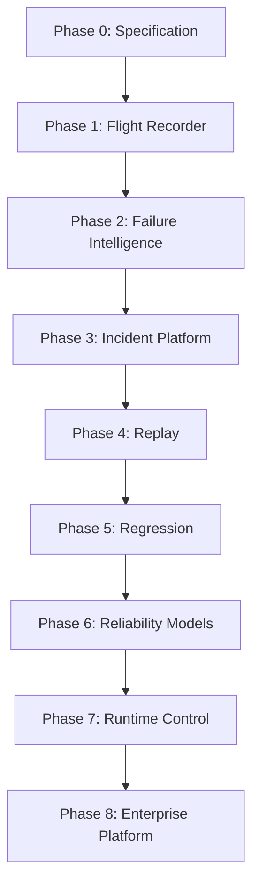

# Harness Reliability Control Plane

## Build, Validation, Security & Commercialization Plan

**Document ID:** HRCP-02\
**Version:** 0.1\
**Status:** Execution Baseline\
**Date:** 30 September 2026\
**Depends On:** HRCP-00, HRCP-01

---

# 1. Purpose

This document answers:

```text
What do we do first?

What do we deliberately not build yet?

What must be validated before the next investment?

How do we determine whether the company is differentiated?

What becomes open source?

How do we create the data flywheel?

How do we obtain real production evidence?

How do we avoid premature architecture lock-in?

How do we reach a commercial product?
```

---

# 2. Execution Philosophy

The company should be built through evidence gates.

Do not execute:

```text
idea
 ↓
18-month engineering project
 ↓
hope
```

Execute:

```text
thesis
 ↓
technical proof
 ↓
design partners
 ↓
real failures
 ↓
reliability intelligence
 ↓
replay
 ↓
commercial validation
 ↓
scale
```

---

# 3. Master Build Sequence



Phases can overlap after their prerequisites are validated.

---

# 4. Phase 0 — Specification and Competitive Teardown

Before serious platform engineering, complete:

```text
Harness Event Model v0.1

Execution Graph v0.1

failure taxonomy v0.1

replay model v0.1

privacy architecture v0.1

threat model v0.1
```

Also conduct architecture teardown of:

```text
Respan

LangSmith / Engine

Arize

Braintrust

HoneyHive

Datadog

Galileo

Laminar

Langfuse

OpenLIT

Phoenix / OpenInference

Portkey
```

---

# 5. Competitive Teardown Template

For every system document:

```text
Product thesis

Open-source components

Instrumentation

Wire protocol

Event/span schema

Trace model

Session model

Agent representation

Subagent representation

Context representation

Memory representation

Tool representation

Verification representation

Storage

Evaluation

Failure detection

Clustering

Replay

Regression

Root-cause analysis

Automated remediation

Runtime control

Security

Privacy

Deployment

Pricing

Moat

Known weakness

What we should integrate

What we should never rebuild

What remains unaddressed
```

---

# 6. Phase 0 Exit Gate

We should not begin broad product engineering until we can answer:

```text
What exists already?

What is commodity?

What do standards already solve?

Where are existing systems structurally insufficient?

Which three capabilities could plausibly create differentiation?
```

Likely candidates:

```text
Harness Event Model

First-Divergence Intelligence

Branch-Aware Replay
```

These are hypotheses until teardown is complete.

---

# 7. Phase 1 — Open Harness Flight Recorder

Goal:

Create the smallest useful open-source product that reconstructs harness execution.

---

# 8. Flight Recorder v0.1 Scope

Support:

```text
run

iteration

model call

tool call

context event

verification

stop reason

subagent relationship

basic state mutation

basic permission decision
```

Output:

```text
structured event stream

timeline

execution tree

basic graph

run metadata

local UI
```

---

# 9. Initial Framework Support

**PROPOSED**

Prioritize approximately three ecosystems rather than ten.

Candidate set:

```text
OpenAI agent ecosystem

Anthropic / coding-agent ecosystem

LangGraph
```

Plus generic OpenTelemetry.

Exact selection requires current technical feasibility analysis.

---

# 10. Flight Recorder Must Work Locally

Target:

```text
pip/npm install

instrument

run agent

open local UI

inspect execution
```

Low-friction installation is strategically important for open-source adoption.

---

# 11. Flight Recorder Success Criteria

Qualitative:

```text
Developers discover information they could not easily see before.
```

Quantitative candidates:

```text
instrumentation overhead acceptable

<1% unparseable normalized events

accurate nesting

accurate stop reason

accurate tool sequence

accurate context event capture
```

Exact thresholds should be benchmarked.

---

# 12. Phase 2 — Deterministic Reliability Detectors

Do not begin with a giant AI root-cause system.

Build reliable detectors first.

Initial detector candidates:

### D1 — Doom Loop

Repeated equivalent action without meaningful state change.

### D2 — Tool Thrashing

Repeated switching among tools without progress.

### D3 — Retry Storm

Repeated retry beyond useful recovery.

### D4 — No Progress

State/output remains effectively unchanged across iterations.

### D5 — Budget Spiral

Projected spend rises while success evidence does not.

### D6 — Verification Bypass

Agent declares completion without required verification.

### D7 — Permission Storm

Repeated requests against denied resources.

### D8 — Context Explosion

Context grows abnormally relative to task progress.

### D9 — Repeated Retrieval

Same material repeatedly retrieved.

### D10 — Invalid Tool Arguments

Repeated schema-level tool failures.

---

# 13. Detector Evaluation

Every detector requires:

```text
definition

positive examples

negative examples

precision

recall

known blind spots

cost

latency

version
```

Avoid shipping detectors that create constant alert fatigue.

---

# 14. Phase 3 — Managed Incident Platform

Once telemetry produces useful signals, build the commercial managed service.

Initial commercial value:

```text
fleet ingestion

incident grouping

failure clustering

release correlation

agent/harness comparison

economics

alerting
```

---

# 15. Incident Formation

Example:

```text
100,000 runs
   ↓
7,921 failures
   ↓
1,188 repeated tool failures
   ↓
3 distinct failure patterns
   ↓
2 material incidents
```

Users should investigate incidents rather than thousands of individual traces.

---

# 16. Incident Center v1

Each incident should answer:

```text
What happened?

How many runs?

When did it begin?

Which versions are affected?

What was the common divergence?

Which component appears responsible?

How much did it cost?

What evidence supports the conclusion?

Can it be reproduced?
```

---

# 17. Release Correlation

Integration targets:

```text
git

CI/CD

container image

prompt registry

agent config

model config

tool registry

policy deployment
```

Example:

```text
Failure rate increased:
4.1% → 13.7%

First observed:
4 minutes after harness v28 deployment.
```

This alone can create immediate operational value.

---

# 18. Phase 4 — First-Divergence Intelligence

Research goal:

Given:

```text
successful cohort

failed cohort
```

find the earliest trajectory difference that meaningfully predicts the outcome.

---

# 19. Technical Research Areas

Investigate:

```text
sequence alignment

trajectory embeddings

graph alignment

state matching

event abstraction

change-point detection

cohort statistics

counterfactual reasoning
```

---

# 20. First-Divergence Benchmark

Create a controlled benchmark where the true injected failure is known.

Example mutations:

```text
remove context field

change tool schema

modify prompt

change permission

change retry threshold

modify memory

change model

modify verification

change budget

change stop condition
```

System must identify:

```text
symptom

first divergence

responsible component

likely configuration change
```

---

# 21. Phase 5 — Replay Foundation

Start replay in a constrained domain.

Coding agents are attractive because the environment can often be containerized.

Capture:

```text
repository SHA

working tree

runtime image

dependencies

environment

filesystem

tool output

model output

test commands

network fixture where possible
```

---

# 22. Replay v1

Initial target:

```text
reproduce previously recorded coding-agent trajectory
without production side effects
```

No branch replay required initially.

---

# 23. Replay Fidelity Metric

Define:

```text
Replay Fidelity =
degree to which replay reproduces
historically relevant states and outcomes
```

Measure separately:

```text
event fidelity

state fidelity

artifact fidelity

outcome fidelity
```

---

# 24. Replay v2 — Branch-Aware Replay

Once deterministic replay works:

```text
historical trajectory
       ↓
apply harness change
       ↓
replay until divergence
       ↓
branch into controlled execution
       ↓
compare outcomes
```

This should be treated as a major engineering milestone.

---

# 25. Replay Safety

Required safeguards:

```text
network controls

credential isolation

sandbox

fake external services

read-only production fixtures

side-effect interception

resource limits

audit log
```

---

# 26. Phase 6 — Regression Platform

Every material incident can become a regression case.

Create:

```text
incident
↓
replay fixture
↓
expected behavior
↓
verification requirements
```

---

# 27. Regression Workbench

A developer proposes a harness change.

System runs:

```text
historical failures

successful control cases

security cases

performance cases
```

Then reports:

```text
success delta

cost delta

latency delta

new failures

fixed failures

behavior change

verification change
```

---

# 28. CI Integration

Example:

```text
Pull Request
     ↓
Harness files changed
     ↓
Run reliability suite
     ↓
Report

Fixed:
17 historical incidents

Introduced:
2 tool regressions

Cost/success:
-8%

Verified success:
+2.4%
```

This can become a highly defensible workflow.

---

# 29. Phase 7 — Specialized Reliability Intelligence

Only after sufficient data exists should we train specialized models.

Possible training data:

```text
trace / graph

failure label

first divergence

root component

fix

replay result
```

---

# 30. Specialized Model Candidates

### Model A — Failure Type Classifier

### Model B — First-Divergence Ranker

### Model C — Root-Component Classifier

### Model D — Incident Similarity Encoder

### Model E — Context-Loss Detector

### Model F — Tool-Misuse Detector

### Model G — Verification-Weakness Detector

### Model H — Regression-Risk Estimator

---

# 31. Model Build-vs-Buy Principle

Do not train custom models for ideological reasons.

Sequence:

```text
rules

existing model

small fine-tune

specialized model

custom architecture
```

Build proprietary models when they materially improve:

```text
cost

latency

accuracy

privacy

scale
```

---

# 32. Phase 8 — Runtime Control

Control should arrive only after the system can reliably detect failures.

Initial interventions should be low-risk.

Examples:

```text
warn

pause

request human

reduce budget

require extra verification
```

Later:

```text
disable tool

deny action

switch model

rollback harness configuration

stop agent
```

---

# 33. Runtime Control Readiness Gate

Do not permit autonomous high-impact intervention until we have measured:

```text
detector precision

false positive rate

incident attribution accuracy

rollback reliability

policy correctness

control-plane availability
```

---

# 34. Security Program

Security begins during Phase 0.

Not after enterprise customers arrive.

---

# 35. Threat Model Categories

The platform will handle potentially hostile content.

Threats include:

```text
prompt injection inside trace payload

malicious tool output

malicious MCP payload

secret leakage

tenant escape

telemetry poisoning

replay escape

sandbox escape

malicious artifact

supply-chain compromise

control-plane abuse

forged telemetry

identity spoofing

data exfiltration
```

---

# 36. Telemetry Is Untrusted Input

**DECIDED**

Never trust captured strings simply because they came from an agent runtime.

Model outputs and tool outputs may contain adversarial content.

Treat them as data.

Not instructions.

---

# 37. Replay Isolation

Replay execution is particularly dangerous.

Required security architecture should consider:

```text
container isolation

microVM isolation

network deny-by-default

filesystem isolation

credential stripping

resource quotas

time limits

output sanitization
```

Architecture must be benchmarked rather than assumed.

---

# 38. Control-Plane Security

Control plane requires stronger authorization than analytics.

Potential separation:

```text
viewer

analyst

replay operator

policy author

control approver

organization administrator
```

---

# 39. Audit Log

Security-relevant actions must be immutable/auditable where practical:

```text
policy change

intervention

replay

data export

retention change

integration change

user permission change
```

---

# 40. Privacy Program

Before enterprise production launch define:

```text
data classification

retention

redaction

regional storage

encryption

customer deletion

training policy

subprocessors

backup policy
```

---

# 41. Compliance Direction

Depending on customer demand:

```text
SOC 2

ISO 27001

GDPR requirements

enterprise DPA

regional deployment
```

Do not perform compliance theatre before product-market evidence, but architecture must not make compliance impossible.

---

# 42. Open-Source Launch Strategy

The OSS project should have a standalone identity and developer utility.

Possible repository structure:

```text
/spec
  harness-event-model

/sdk
  python
  typescript

/instrumentation
  openai
  anthropic
  langgraph
  mcp

/collector

/local-ui

/examples

/benchmarks
```

---

# 43. Open-Source Boundary

Strong candidate:

```text
OPEN

schema

semantic conventions

SDK

collector

instrumentation

basic local viewer

basic deterministic detectors
```

Commercial:

```text
managed fleet

incident intelligence

large-scale clustering

first-divergence intelligence

replay infrastructure

regression platform

advanced reliability models

enterprise control

security/governance
```

---

# 44. Open-Source License

**OPEN**

Evaluate:

```text
Apache 2.0

MIT

other permissive approach
```

We should generally prefer developer adoption and standardization over trying to protect telemetry schema through licensing.

---

# 45. Standardization Strategy

If Harness Event Model proves useful:

```text
publish specification

gather community feedback

align with OTel/OpenInference

upstream broadly useful conventions
```

We should not depend on a private telemetry syntax as the business moat.

---

# 46. Community Strategy

Useful community contributions:

```text
framework adapters

tool adapters

detectors

visualizations

semantic conventions

benchmark scenarios
```

---

# 47. Design Partner Program

Before broad commercial launch recruit approximately:

```text
5–10 serious design partners
```

Prefer quality over number.

---

# 48. Design Partner Requirements

Strong candidates should have:

```text
production agents

real failures

complex trajectories

engineering team

willingness to instrument deeply

ability to provide feedback

repeatable workloads
```

---

# 49. First Design Partner Questions

Ask:

```text
How do you debug agent failures today?

How long does an investigation take?

What information is missing?

Can you reproduce failures?

How often do failures repeat?

What percentage require manual trace reading?

How do you evaluate harness changes?

How do you prevent regressions?

How do you measure cost per successful task?

What actions are too dangerous to automate?

Which telemetry cannot leave your environment?
```

---

# 50. What Not to Ask

Avoid:

```text
Would you buy AI observability?
```

That question produces weak evidence.

Observe actual engineering pain.

---

# 51. Product-Market Validation Signal

Strong evidence:

```text
customer repeatedly uses incident diagnosis

customer uploads/streams real production data

replay prevents a regression

customer changes release workflow because of platform

customer asks to expand team usage

customer pays meaningful amount
```

Weak evidence:

```text
"cool demo"

conference interest

GitHub stars alone

social engagement
```

---

# 52. Coding-Agent Wedge Validation

Initial experiment:

Instrument several coding-agent systems on a known task suite.

Inject harness failures.

Examples:

```text
wrong tool schema

missing context

permission denial

bad retry policy

memory poisoning

incorrect verification

budget reduction

subagent context loss
```

Check whether our event model makes the failure easy to locate.

---

# 53. Reliability Benchmark

Working concept:

# Harness Reliability Benchmark

Name **PROPOSED**.

The benchmark should evaluate:

```text
detection

localization

first divergence

root-component attribution

reproduction

fix validation

regression detection
```

---

# 54. Benchmark Case Structure

Each case should include:

```text
task

environment

baseline harness

mutated harness

injected fault

expected symptom

true first divergence

true responsible component

expected evidence

success criteria
```

---

# 55. Benchmark Domains

Begin with controlled coding-agent environments.

Later:

```text
browser agents

research agents

workflow agents

tool-use agents

multi-agent systems
```

---

# 56. Evaluation Metrics

### Detection

Precision / recall.

### Localization

How close identified divergence is to ground truth.

### Root Component

Classification accuracy.

### Incident Clustering

Cluster quality.

### Replay

Reproduction rate.

### Regression

Failure detection accuracy.

### Cost

Analysis cost per run / incident.

### Latency

Time from failure to useful diagnosis.

---

# 57. Intelligence Evaluation

Never evaluate diagnosis only by asking another LLM whether the explanation sounds good.

Use ground-truth injected failures where possible.

---

# 58. Synthetic Data

Synthetic failures are useful for controlled evaluation.

They are not sufficient.

Need real production failures before claiming robustness.

---

# 59. Failure Corpus

Build a corpus containing:

```text
raw execution

normalized events

execution graph

failure symptom

first divergence

root component

root-cause evidence

fix

replay result

regression result
```

This becomes one of the company's critical assets.

---

# 60. Data Governance

Every corpus item should include data rights.

Examples:

```text
internal benchmark

open-source permitted

customer-isolated

model-training prohibited

model-training allowed
```

Never infer permission.

---

# 61. Economics Research

Measure cost of:

```text
ingestion

storage

indexing

detectors

embeddings

LLM analysis

replay

regression
```

We must know our own:

```text
cost per million runs

cost per active incident

cost per replay

cost per regression suite
```

before pricing.

---

# 62. Price Architecture Experiments

Candidate pricing units:

```text
base subscription

runs analyzed

telemetry GB

retention

active incidents

replay compute

regression compute

control nodes
```

Do not choose final pricing until production cost data exists.

---

# 63. Why Span-Based Pricing Alone Is Dangerous

A successful long-running agent may generate thousands of spans.

Charging directly by span can punish customers for rich instrumentation.

It also encourages them to turn observability off.

---

# 64. Value Metric Research

Test whether customers value:

```text
agent runs

successful jobs

verified jobs

incidents

replays

engineering seats

controlled agents
```

---

# 65. GTM Sequence

Potential progression:

```text
OSS developer adoption

↓

technical design partners

↓

managed observability

↓

incident intelligence

↓

replay / regression

↓

enterprise reliability

↓

control-plane expansion
```

---

# 66. Messaging

Do not lead with:

```text
AI-powered LLM observability.
```

Possible positioning:

> Reliability infrastructure for production agents.

Or:

> Understand why your agents fail, reproduce the failure, and prevent it from returning.

Or:

> The reliability control plane for autonomous agents.

Messaging remains subject to customer testing.

---

# 67. Sales Motion

Likely initial buyer:

```text
Head of AI Engineering

AI Platform Lead

Agent Infrastructure Lead

CTO of AI-native company
```

Users may include:

```text
AI engineers

SRE

platform engineering

security
```

---

# 68. Enterprise Expansion

Potential land-and-expand:

```text
single agent team

↓

organization-wide telemetry

↓

replay / regression

↓

shared policy

↓

security

↓

runtime control
```

---

# 69. Team Requirements — Early Stage

Core expertise needed:

### Distributed systems

Telemetry, ingestion, high-volume storage.

### Developer tooling

SDK, instrumentation, integrations.

### Agent systems

Frameworks, tool loops, context, memory.

### Reliability engineering

Incidents, regression, observability.

### Security / sandboxing

Especially replay.

### ML

Clustering and specialized reliability models.

Not all require full-time hires immediately.

---

# 70. Build-vs-Buy Rules

Buy/integrate commodity infrastructure where differentiation is weak.

Examples potentially suitable for integration:

```text
auth

billing

basic OTel

cloud object storage

ordinary databases

ordinary dashboards where sufficient
```

Build where value compounds:

```text
semantic model

execution graph

incident intelligence

trajectory comparison

replay

regression

reliability models

control logic
```

---

# 71. Engineering Principle — No Architecture Astronautics

Do not build the final 100-billion-event architecture before real usage.

But also do not choose shortcuts that destroy evidence needed for future replay.

Balance:

```text
minimum implementation

with

correct fundamental contracts
```

The most important contracts to get right early are:

```text
identity

versioning

event semantics

evidence provenance

tenant boundary

schema evolution

replay references
```

---

# 72. Research Streams

Run separate research streams for:

### R1 — Telemetry semantics

### R2 — Execution graph

### R3 — Trajectory alignment

### R4 — First divergence

### R5 — Replay

### R6 — Context lineage

### R7 — Failure clustering

### R8 — Specialized models

### R9 — Sandbox security

### R10 — Runtime policy

---

# 73. Build Sequence in Greater Detail

```text
SPECIFICATION
    ↓
SDK
    ↓
LOCAL RECORDER
    ↓
NORMALIZER
    ↓
EVENT STORE
    ↓
RUN EXPLORER
    ↓
DETERMINISTIC DETECTORS
    ↓
MANAGED INGESTION
    ↓
INCIDENT GROUPING
    ↓
COHORT COMPARISON
    ↓
FIRST DIVERGENCE
    ↓
REPLAY
    ↓
REGRESSION
    ↓
RELIABILITY MODELS
    ↓
CONTROL
```

---

# 74. Why This Ordering Matters

If we build AI diagnosis before semantics:

```text
garbage telemetry
→ expensive reasoning
→ unreliable explanation
```

If we build replay before versioning:

```text
cannot reconstruct environment
```

If we build runtime control before detector precision:

```text
false positives become production incidents
```

If we build enterprise dashboards before differentiated intelligence:

```text
we become another observability UI
```

---

# 75. Phase Gates

## Gate A — Semantic Viability

Can the event model represent real agent runtimes without massive framework-specific exceptions?

## Gate B — Developer Utility

Does the Flight Recorder materially improve debugging?

## Gate C — Reliability Signal

Can deterministic detectors find useful failures?

## Gate D — Incident Value

Can thousands of traces be reduced to actionable incidents?

## Gate E — Divergence Value

Can the system reliably identify where bad trajectories separate from good ones?

## Gate F — Replay Feasibility

Can important failures be reproduced safely?

## Gate G — Regression Value

Does replay prevent real regressions?

## Gate H — Commercial Value

Will teams pay for the workflow?

## Gate I — Control Readiness

Is reliability sufficient to intervene automatically?

---

# 76. Kill Criteria

We should be willing to revise or kill the thesis if evidence shows:

```text
framework instrumentation cannot be normalized meaningfully;

customers are satisfied with generic trace observability;

replay is economically useless;

first-divergence analysis provides little value;

agent failures are too unique for reusable reliability intelligence;

existing incumbents already solve the problem adequately;

customers will not grant sufficient telemetry access.
```

A source-of-truth document should include reasons to stop, not only reasons to continue.

---

# 77. Competitive Response Policy

If a competitor ships one of our planned capabilities:

Do not automatically abandon it.

Ask:

```text
Is their implementation structurally complete?

Does it support our target use case?

Is it commoditized?

Should we integrate rather than build?

Does our architecture still add something unique?
```

---

# 78. Documentation Governance

Each specification should contain:

```text
version

status

owner

dependencies

decision log

open questions

change history
```

---

# 79. Architecture Decision Records

Any significant change should receive an ADR.

Example:

```text
ADR-014
Use OTel baggage for propagation of run identity.

Context
Options
Decision
Reasons
Consequences
Rollback
```

---

# 80. Source-of-Truth Hierarchy

If documents conflict:

```text
HRCP-00 Product Constitution

        ↓

approved ADR

        ↓

HRCP-01 Architecture

        ↓

component specification

        ↓

implementation documentation
```

An implementation README does not silently override product architecture.

---

# 81. Change Management

A DECIDED item may be changed.

But the change should record:

```text
old decision

new decision

reason

evidence

affected components

migration plan
```

This is important because this product itself depends heavily on historical provenance.

We should apply the same discipline internally.

---

# 82. Immediate Next Research Package

The next documents should be created in this order:

## HRCP-03 — Harness Telemetry & Execution Graph Specification

This should become extremely detailed.

It should define:

```text
every event

every field

every relationship

required vs optional fields

identity

versioning

evidence

examples

OTel mapping

OpenInference mapping
```

This is the foundation.

---

# 83. HRCP-04 — Replay, Simulation & Regression

Must answer:

```text
What exactly is captured?

What can be deterministically replayed?

How are external services represented?

What is branch replay?

How do we prevent side effects?

How is replay fidelity measured?

How are historical failures converted into test cases?
```

---

# 84. HRCP-05 — Reliability Intelligence

Define:

```text
failure taxonomy

detectors

incident clustering

trajectory alignment

first divergence

root-component attribution

confidence

specialized models

human review
```

---

# 85. HRCP-06 — Runtime Control

Define:

```text
policy language

interventions

risk levels

human approval

fail-open/fail-closed

rollback

control audit

latency requirements
```

---

# 86. HRCP-07 — Enterprise Security & Privacy

Define:

```text
threat model

tenant isolation

encryption

secret handling

retention

customer-side payload

private deployment

replay security

control-plane security
```

---

# 87. HRCP-08 — Integration Framework

Define adapter contracts for:

```text
agent frameworks

model providers

MCP

tools

memory

sandboxes

identity

CI

APM
```

---

# 88. HRCP-09 — Benchmark

Create the test harness for testing our own claims.

Without HRCP-09 we risk producing impressive demos with no objective evidence.

---

# 89. HRCP-10 — Open Source

Define:

```text
repos

license

governance

contribution model

release model

commercial boundary

upstream standards strategy
```

---

# 90. Immediate Engineering Proofs

Before broad implementation, create small proofs for:

### Proof A

Capture a complex coding-agent execution using OTel.

### Proof B

Normalize executions from two different frameworks into the same semantic model.

### Proof C

Visualize context changes and verification gates.

### Proof D

Detect a deliberate doom loop.

### Proof E

Compare a successful and failed trajectory.

### Proof F

Identify the deliberately inserted first divergence.

### Proof G

Replay a recorded coding-agent failure.

These prototypes will validate the architecture more effectively than a polished SaaS dashboard.

---

# 91. Current Priority Ranking

## Priority 0

Complete competitor architecture teardown.

## Priority 1

Harness Event Model.

## Priority 2

Execution identity + graph.

## Priority 3

Flight Recorder.

## Priority 4

Failure taxonomy + deterministic detectors.

## Priority 5

Incident grouping and cohort comparison.

## Priority 6

First-divergence engine.

## Priority 7

Replay.

## Priority 8

Regression.

## Priority 9

Specialized models.

## Priority 10

Runtime control.

---

# 92. Things We Should Explicitly Avoid Right Now

Do not build:

```text
another generic prompt playground

another LLM gateway

generic RAG platform

generic vector database

generic memory platform

generic IAM

generic MCP marketplace

generic AI security platform

generic AI agent builder

generic workflow builder

full BPO platform

universal document parser

huge proprietary tracing protocol
```

Those would dilute the thesis.

---

# 93. North-Star Technical Demonstration

A compelling future demo should be:

```text
1. Launch 10,000 autonomous agent jobs.

2. Introduce a subtle context-policy regression.

3. Failure rate increases.

4. Platform detects an incident automatically.

5. Platform identifies first divergence.

6. Platform traces the divergence to the context component.

7. Platform shows the release that introduced it.

8. Platform proposes a likely remediation.

9. Platform replays historical affected trajectories.

10. Platform runs regression corpus.

11. Platform reports success/cost tradeoff.

12. Human approves deployment.

13. Platform observes recovery.

14. Failure becomes permanent regression case.
```

If we can genuinely deliver this, we have something much more valuable than an LLM tracing dashboard.

---

# 94. Long-Term North-Star Demonstration

Eventually:

```text
production failure detected
        ↓
incident formed
        ↓
root cause identified
        ↓
fix generated
        ↓
historical replay
        ↓
regression suite
        ↓
risk assessed
        ↓
policy checks
        ↓
human approval if necessary
        ↓
canary
        ↓
verified recovery
```

This is:

# Closed-Loop Agent Reliability

---

# 95. The Company We Are Trying to Build

Not:

> a place where engineers look at AI logs.

But:

> an infrastructure layer that continuously converts autonomous-agent execution into evidence, incidents, reproducible failures, regression cases, and safer future behavior.

---

# 96. Final Execution Principle

Our strongest possible company is created when this flywheel works:

```text
More agent execution
        ↓
More failure evidence
        ↓
Better failure understanding
        ↓
Better replay
        ↓
Better regression
        ↓
Better reliability models
        ↓
Better prevention
        ↓
Safer autonomous agents
        ↓
More production usage
        ↓
More agent execution
```

That is the system we should now validate.
